<div align="center">

# 🔐 Secure Web App 2

### Shift-Left DevSecOps Pipeline with Automated Security Scanning

[](https://www.jenkins.io/)
[](https://www.sonarsource.com/products/sonarqube/)
[](https://www.zaproxy.org/)
[](https://www.docker.com/)
[](https://flask.palletsprojects.com/)

**A complete DevSecOps implementation integrating SAST, Docker containerization, and DAST in an automated CI/CD pipeline**

---

### 👨‍💻 Developed By

**Saleem Ali**  
🎓 Al-Nafi International College — AIOps Program  
📅 April 2026

[](https://www.linkedin.com/in/saleem-ali-189719325/)
[](https://github.com/ali4210?tab=repositories)

</div>

---

## 📖 Table of Contents

- [🎯 Project Overview](#-project-overview)
- [🏗️ Architecture](#️-architecture)
- [🛠️ Tech Stack](#️-tech-stack)
- [📁 Project Structure](#-project-structure)
- [⚙️ Prerequisites](#️-prerequisites)
- [🚀 Quick Start](#-quick-start)
- [🔒 Security Implementations](#-security-implementations)
- [📊 Viewing Results](#-viewing-results)
- [💡 Shift-Left Principle](#-shift-left-principle)
- [📚 Documentation](#-documentation)

---

## 🎯 Project Overview

This project demonstrates the **Shift-Left Security Approach** in modern DevSecOps practices. By integrating automated security scanning directly into the CI/CD pipeline, vulnerabilities are detected and remediated **early in the development lifecycle** — significantly reducing the cost and risk of security issues reaching production.

### 🔑 Key Features

✅ **Automated SAST** with SonarQube for static code analysis  
✅ **Automated DAST** with OWASP ZAP for runtime vulnerability detection  
✅ **Containerized deployment** using Docker  
✅ **Full CI/CD automation** via Jenkins  
✅ **Security-hardened application** with parameterized queries and secure configurations  
✅ **Comprehensive reporting** for compliance and auditing

---

## 🏗️ Architecture

```mermaid
graph LR
    A[👨‍💻 Developer] -->|Push Code| B[📦 Git Repository]
    B -->|Trigger| C[🔧 Jenkins Pipeline]
    C -->|Stage 1| D[🔍 SonarQube SAST]
    D -->|Pass| E[🐳 Docker Build]
    E -->|Deploy| F[🌐 Flask App]
    F -->|Stage 2| G[⚡ OWASP ZAP DAST]
    G -->|Generate| H[📊 Security Reports]
    
    style A fill:#4CAF50
    style D fill:#4E9BCD
    style G fill:#FF5722
    style H fill:#FFC107
```



**Pipeline Flow:**
```
Code Commit → Jenkins Trigger → SonarQube SAST → Docker Build → Deploy → ZAP DAST → Report Generation
```

---

## 🛠️ Tech Stack

<table>
<tr>
<td>

**🔧 CI/CD & Automation**
- Jenkins (OpenJDK 21)
- Git

**🔍 Security Scanning**
- SonarQube 10.5 (SAST)
- OWASP ZAP (DAST)
- SonarScanner

</td>
<td>

**🐳 Containerization**
- Docker
- Dockerfile

**💻 Application**
- Python 3.x
- Flask 3.0.0
- SQLite (demo DB)

</td>
<td>

**🖥️ Infrastructure**
- Kali Linux
- OpenJDK 17 (SonarQube)
- OpenJDK 21 (Jenkins)

</td>
</tr>
</table>

---

## 📁 Project Structure

```
secure-web-app-2/
│
├── 📄 app.py                  # Original Flask application (with vulnerabilities)
├── 📄 app_secure.py           # Security-hardened version
├── 📄 requirements.txt        # Python dependencies (Flask 3.0.0)
├── 🐳 Dockerfile              # Container build instructions
├── 🔧 Jenkinsfile             # CI/CD pipeline definition
├── 📖 README.md               # This file
└── 📚 DOCUMENTATION.md        # Comprehensive technical documentation
```

---

## ⚙️ Prerequisites

Before running this project, ensure you have the following installed and configured:

| Component | Requirement |
|-----------|-------------|
| **Operating System** | Kali Linux (or any Debian-based distribution) |
| **Jenkins** | Installed with OpenJDK 21 |
| **SonarQube** | Running on `http://localhost:9000` with OpenJDK 17 |
| **OWASP ZAP** | Running on `http://localhost:8090` |
| **Docker** | Installed and daemon running |
| **SonarScanner** | Installed at `/opt/sonar-scanner/` |

---

## 🚀 Quick Start

### Step 1: Clone/Navigate to Project

```bash
cd /root/Al-Razzak-Labs-2/DevSecOps/secure-web-app-2
```

### Step 2: Set Permissions for Jenkins

```bash
sudo chmod o+x /root
sudo chmod -R o+rx /root/Al-Razzak-Labs-2
```

### Step 3: Configure SonarQube

1. Navigate to `http://localhost:9000`
2. Create a new project with key: `Secure-Web-App-2`
3. Generate a **Global Analysis Token**
4. Save the token securely

### Step 4: Configure Jenkins Pipeline

1. Open Jenkins dashboard
2. Navigate to the `Secure-web-app-2` job
3. Update the `SONAR_TOKEN` in the pipeline environment block
4. Save the configuration

### Step 5: Execute Pipeline

Click **Build Now** in Jenkins to start the automated security pipeline!

---

## 🔒 Security Implementations

This project includes two versions to demonstrate security improvements:

<table>
<tr>
<th>Version</th>
<th>File</th>
<th>SQL Injection Protection</th>
<th>Secret Key Management</th>
<th>Status</th>
</tr>
<tr>
<td><strong>Original</strong></td>
<td><code>app.py</code></td>
<td>❌ No protection</td>
<td>❌ Hardcoded/None</td>
<td>🔴 Vulnerable</td>
</tr>
<tr>
<td><strong>Hardened</strong></td>
<td><code>app_secure.py</code></td>
<td>✅ Parameterized queries</td>
<td>✅ <code>secrets.token_hex(16)</code></td>
<td>🟢 Secure</td>
</tr>
</table>

### Switching to Secure Version

```bash
# Backup original
cp app.py app_backup.py

# Deploy secure version
cp app_secure.py app.py

# Re-run pipeline to compare results
```

---

## 📊 Viewing Results

After pipeline execution, access your security reports:

| Report Type | Access URL | Description |
|------------|-----------|-------------|
| **🔍 SAST Results** | [`http://localhost:9000/dashboard?id=Secure-Web-App-2`](http://localhost:9000/dashboard?id=Secure-Web-App-2) | Static code analysis findings |
| **⚡ DAST Report** | Jenkins sidebar → *ZAP DAST Report - Secure Web App 2* | Dynamic security testing results |

---

## 💡 Shift-Left Principle

### Traditional Approach ❌
```
Code → Build → Deploy → Test → Production → 😱 Vulnerability Found (High Cost to Fix)
```

### Shift-Left Approach ✅
```
Code → 🔍 SAST → Build → Deploy → ⚡ DAST → Production → ✨ Secure from Start (Low Cost)
```

**Benefits:**
- 🎯 Early vulnerability detection
- 💰 Reduced remediation costs
- ⚡ Faster deployment cycles
- 🛡️ Improved security posture
- 📊 Continuous compliance

---

## 📚 Documentation

For comprehensive technical details including:
- Full pipeline code breakdown
- Troubleshooting guides
- Detailed phase explanations
- Advanced configurations

**See:** [`DOCUMENTATION.md`](./DOCUMENTATION.md)

---

<div align="center">

### 🌟 If you found this project helpful, consider giving it a star!

---

**© 2026 Saleem Ali**  
*Al-Nafi International College — AIOps Program*

[](https://www.linkedin.com/in/saleem-ali-189719325/)
[](https://github.com/ali4210?tab=repositories)

*Building secure, automated DevSecOps pipelines one project at a time* 🚀

</div>
